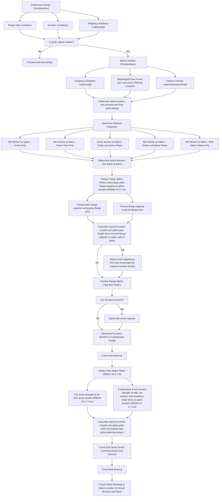

```mermaid
flowchart TD
    A[Preliminary Design Considerations] --> B[Shipping Limitations Load/Length]
    A --> C[Project Site Limitations]
    A -->D[Erection Limitations]
    C -->E[Is girder splice needed?]
    D -->E
    B -->E
    E -->|No| F[Proceed with final design]
    E -->|Yes| G[Splice Location Considerations]
    G -->H[Shipping Limitations Load/Length]
    G --> I[Diaphragm/Cross Frame and Transverse Stiffener Locations]
    G --> J[Feature crossed water/roadway/railroad]
    H --> K[Determine splice location and proceed with final splice design]
    I --> K
    J --> K
    K --> L[Determine Material Properties]
    L --> M[Net Section at Splice - Girder Only]
    L --> N[Net Section at Splice - Girder Web Only]
    L --> O[Gross Section at Splice - Girder and Splice Plates]
    L --> P[Net Section at Splice - Girder and Splice Plates]
    L --> Q[Net Section at Splice - Web Splice Plates Only]
    M --> R[Determine Actual Moment and Shear at Splice]
    N --> R
    O --> R
    P --> R
    Q --> R
    R --> S[Design Flange Splice Plates Check least yield flange capacity at splice location AREMA 15-1.7.5a]
    S --> T[Compression flange capacity using gross flange area]
    S --> U[Tension flange capacity using net flange area]
    T --> V[Calculate required number of bolts and splice plate length Must transmit flange capacity on either side of splice]
    U --> V
    V --> |Yes| W[Reduce bolt capacity by 20% and recalculate the required number of bolts]
    V --> |No| X[Finalize Flange Splice Plate Bolt Pattern]
    W --> X
    X --> Y[Are fill plates present?]
    Y --> |Yes| Z[Adjust bolt shear capacity]
    Y --> |No| AA[Determine Eccentric Moment in Compression Flange]
    Z --> AA
    AA --> BB[Check Bolt Bearing]
    BB --> CC[Design Web Splice Plates AREMA 15-1.7.6a]
    CC --> DD[Full shear strength of the web, gross section AREMA 15-1.7.6.a1]
    CC --> EE[Combination of full moment strength of web, net section, with maximum shear force at splice location AREMA 15-1.7.6.a2]
    DD --> FF[Calculate required number of bolts and splice plate width and finalize web splice plate bolt pattern]
    EE --> FF
    FF --> GG[Check Bolt Shear Stress Combined Shear and Moment]
    GG --> HH[Check Bolt Bearing]
    HH --> II[Check Girder Bending at Splice Location for Actual Moment and Shear]

%% AREMA Links %%
    click S "https://www.youtube.com/watch?v=-XV1JBfhgWo&list=PLw5h0DiJ-9PC49ItLKBQlWSMH1zolOCXS"
    click CC "https://www.youtube.com/watch?v=-XV1JBfhgWo&list=PLw5h0DiJ-9PC49ItLKBQlWSMH1zolOCXS"
    click DD "https://www.youtube.com/watch?v=-XV1JBfhgWo&list=PLw5h0DiJ-9PC49ItLKBQlWSMH1zolOCXS"
    click EE "https://www.youtube.com/watch?v=-XV1JBfhgWo&list=PLw5h0DiJ-9PC49ItLKBQlWSMH1zolOCXS"
```